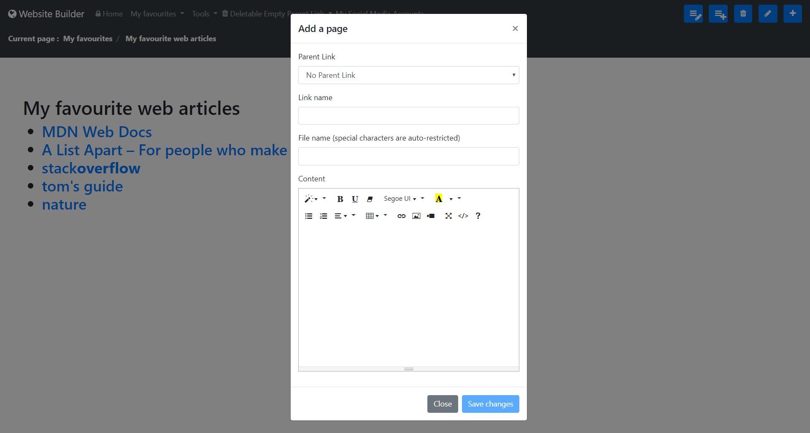
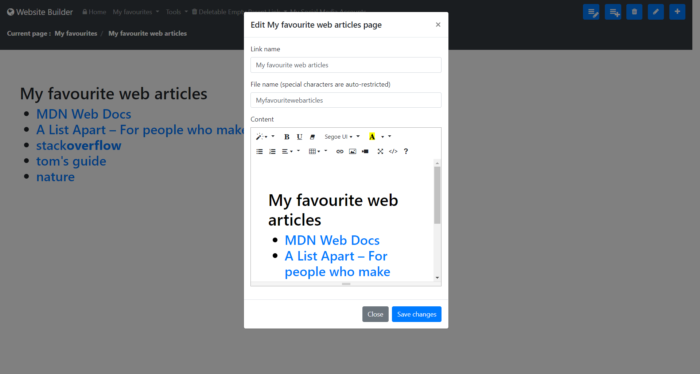

# **Description**
## A simple tool for managing content. Create content with add, update and delete features. Can also be used to host other applications.
# **Tech stack**
## NodeJS, Express, EJS, CSS 3, ES 5/6, jQuery 3.4.1, Popper 1.16.0, Bootstrap 4.3.1, Font Awesome 4.7.0, Summer Note 0.8.12, JSON Editor, FileSaver.js, etc.
# **Instructions for running this app locally**
## Step 1: Clone
## Step 2: Run 'npm install' in terminal
## Step 3: Run 'npm install nodemon -g' in terminal
## Step 4: Run 'nodemon server.js' in terminal
## Step 5: Goto 'localhost:8080' in your browser
## Step 6: Incase the java tools under 'Utilities' section fails, update jdk, jre and system variables - JAVA_HOME and Path 
# **Application snapshot**
## ***View content***

## ***Add content***

## ***Edit content***

## ***etc... And many more to come!!***
# **Contact person**
## Ribhu Biswas
## ribhubiswas@gmail.com
## +91 9845403046
